# 📚 Biblioteca Digital - Proyecto Python

**Autor:** Juan Pablo Gonzalez Trujillo  
**Fecha:** Septiembre 2025  
**Lenguaje:** Python  
**Tema:** Programación Orientada a Objetos (POO)  
**Interfaz:** Consola (CLI)

## 🎯 Descripción del Proyecto

Este proyecto simula el funcionamiento básico de una **biblioteca digital**, aplicando los 4 pilares fundamentales de la **Programación Orientada a Objetos (POO)** en Python.

El sistema permite:

- Crear y listar usuarios
- Crear y listar materiales (libros y revistas)
- Realizar préstamos y devoluciones
- Calcular multas por retraso
- Generar reportes de préstamos activos

Todo esto desde una **interfaz de línea de comandos (CLI)** interactiva.

---

## 🧱 Aplicación de los Pilares POO

- **Abstracción:**  
  Se define una clase abstracta `Item`, que establece un modelo común para los materiales prestables.

- **Herencia:**  
  Las clases `Libro` y `Revista` heredan de `Item`, reutilizando atributos y comportamientos.

- **Polimorfismo:**  
  Los métodos `prestamo()` y `multa()` se implementan de manera distinta en `Libro` y `Revista`, pero se usan de forma uniforme.

- **Encapsulación:**  
  Uso de `@property` y validaciones para proteger atributos como `stock` y `documento`, restringiendo acceso directo.

---

## 🖼️ Capturas del Sistema

### ▶️ Menú principal (CLI)
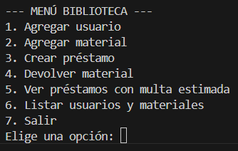

---

### 👤 Gestión de usuarios
En el código:
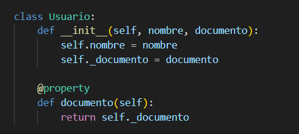
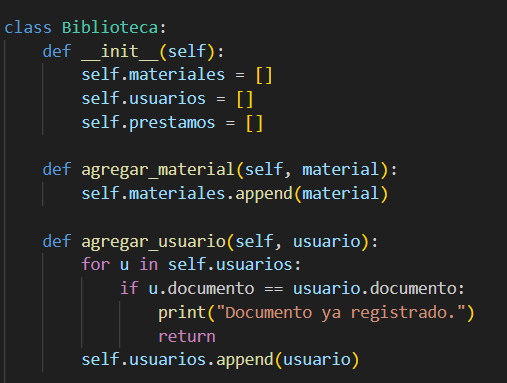
En la ejecución:
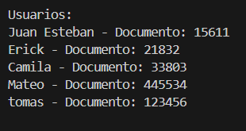

---

### 📦 Materiales registrados
En el código:
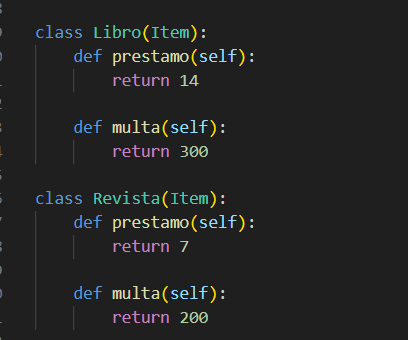
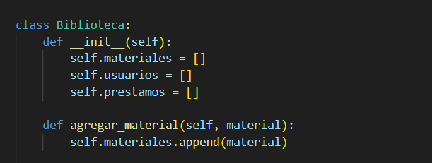
En la ejecución:
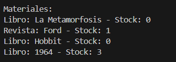
---

### ✅ Préstamo exitoso
En el código:
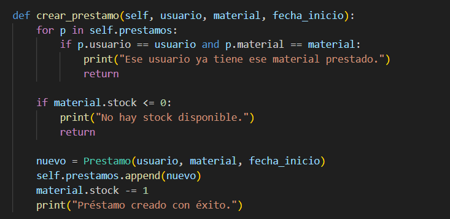
En la ejecución:
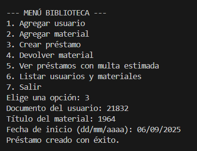

---

### 🔁 Devolución con multa
En el código:
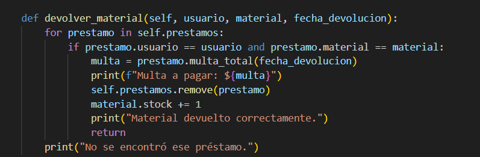
En la ejecución:
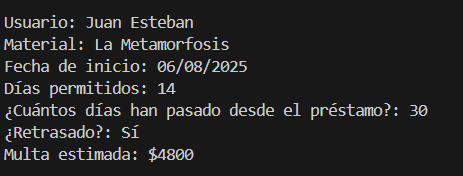

---

### 📊 Reporte de préstamos activos
En el código:
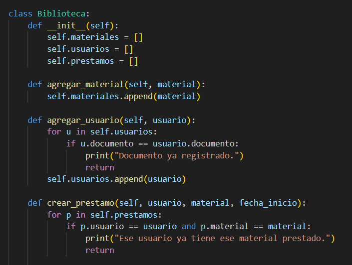
En la ejecución:
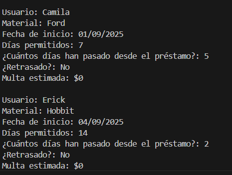
---

## 🧪 Casos de prueba incluidos

- **Juan Esteban** pidió el libro *"La Metamorfosis"* hace un mes → genera multa.
- **Camila** pidió la revista *"Ford"* hace 5 días → sin multa.
- **Erick** pidió el libro *"Hobbit"* → préstamo válido.
---

## ▶️ Cómo ejecutar el sistema
Se recomienda abrir el ejecutable app.py en visual estudio code o Google Colab.

1. Asegúrate de tener Python 3 instalado.
2. Ejecuta el archivo en consola:

```bash
python biblioteca.py


